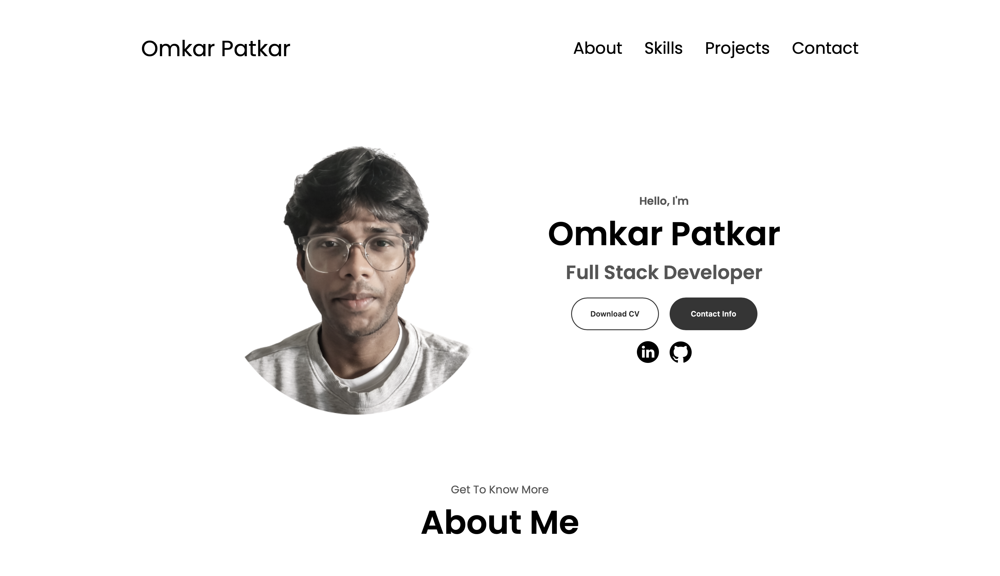

# 💼 Omkar Patkar - Developer Portfolio

Welcome to my personal developer portfolio website!  
It’s a responsive, mobile-friendly site built with **HTML**, **CSS**, and **JavaScript**, showcasing who I am, what I’ve built, and how to connect with me.

🔗 **Live Site:** [omkaaaaaar.vercel.app](https://omkaaaaaar.vercel.app)

---

## 📸 Preview

 <!-- replace with an actual screenshot if available -->

---

## 🔥 Features

- ⚡ Smooth scroll navigation
- 📱 Fully responsive layout (Desktop & Mobile)
- 👨‍💻 About Me + Education Section
- 🧠 Skills (Frontend & Backend split)
- 📊 Scrollable GitHub Contributions Graph
- 💼 Highlighted Projects with Live Demos
- 🏆 Certificate Section with image previews
- 📬 Contact Me section with email and LinkedIn
- 🍔 Hamburger menu for mobile navigation

---

## 🛠 Tech Stack

| Tech       | Purpose                |
|------------|------------------------|
| HTML5      | Page structure         |
| CSS3       | Styling & layout       |
| JavaScript | Interactivity / Toggle |
| GitHubCalendar.js | Contributions graph |
| Responsive Design | Mobile-first approach |

---

## 📂 Folder Structure

